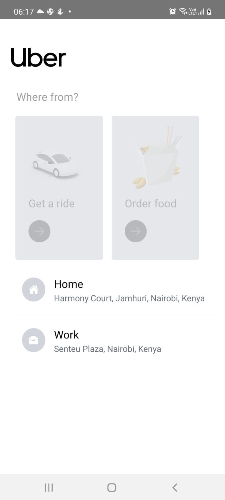
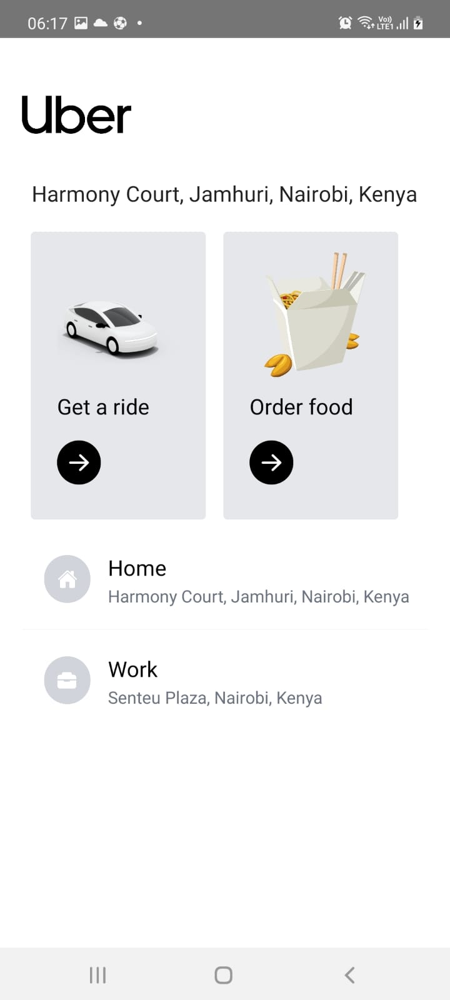
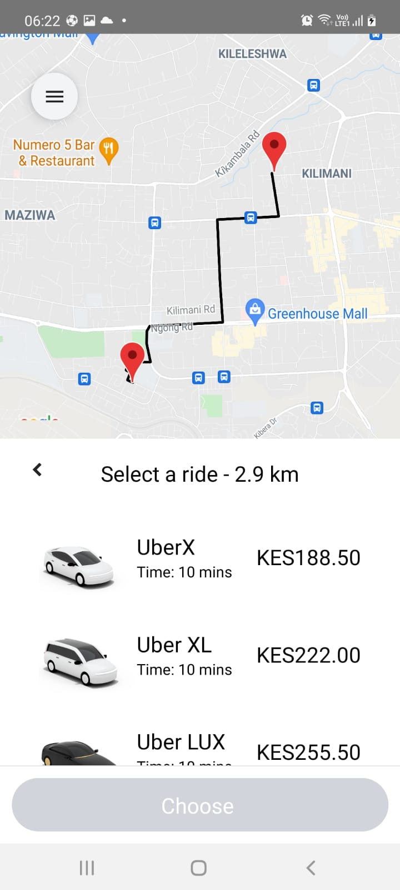

## Uber Clone Challenge
This is a React Native app built using TailwindCSS and a number of Google Maps API to simulate how an Uber app works.

The design has been done using TailwindCSS, which is very friendly, and Google Maps API for the mappiing, estimation of distances e.t.c:
- Directions API - directions from A - B
- Distance Matrix API - mileage calculations
- Places API
- Maps SDK for Android - had to be enabled to work on Android

This is thanks to the good work of **Sonny Sangha** and the entire video tutorial can be found [here](https://www.youtube.com/watch?v=bvn_HYpix6s)

## TODOS
- [x] Setting up with React Native Cli
- [x] Run on Android device
- [ ] Run on iOS

## Screenshots

